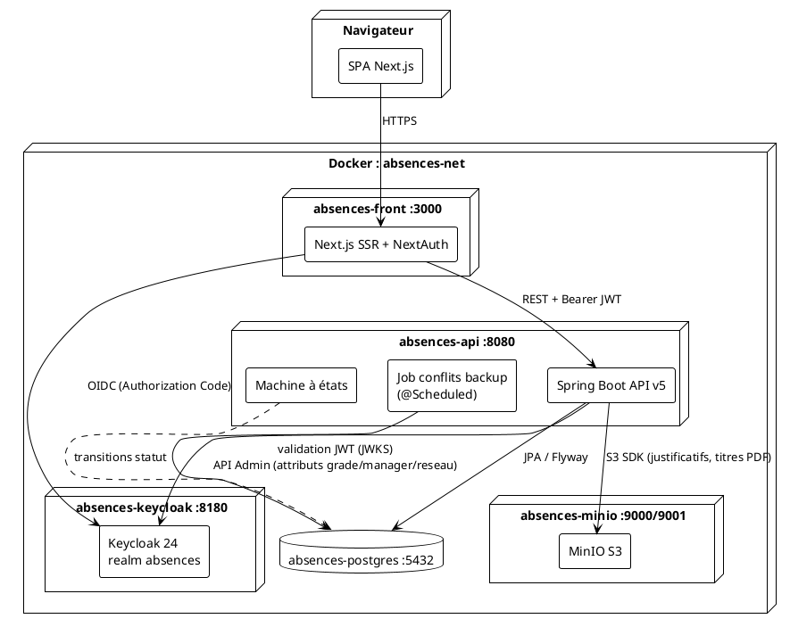
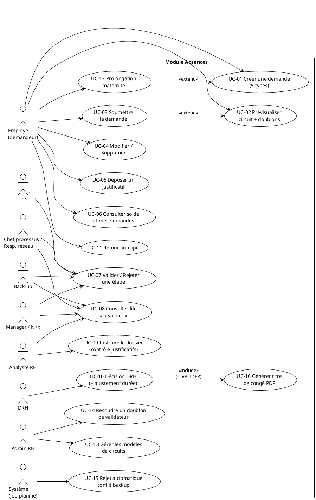
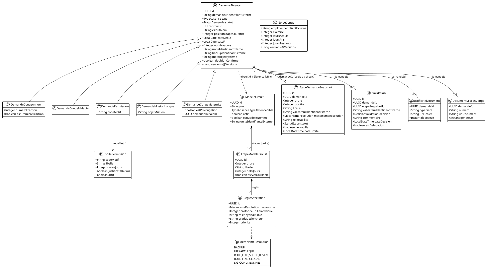
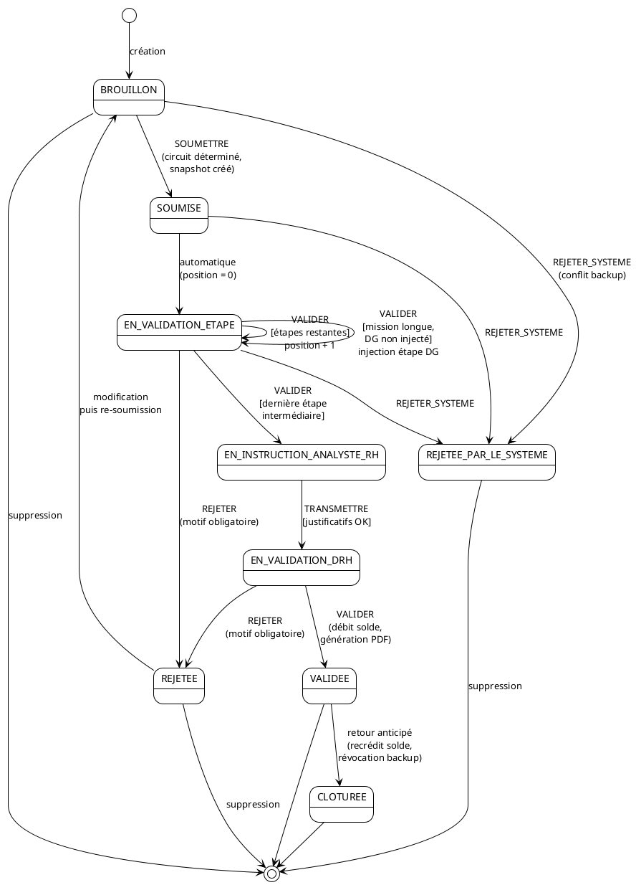
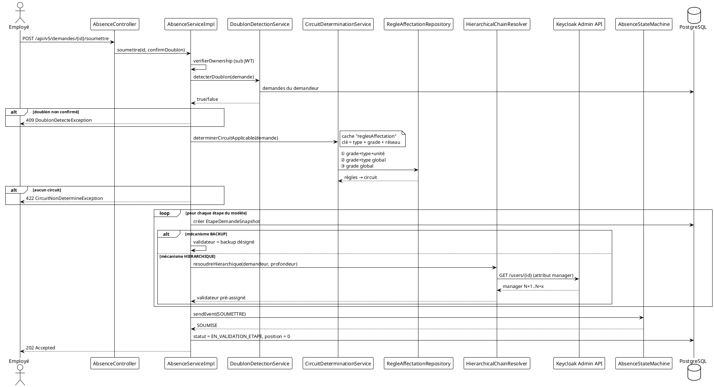
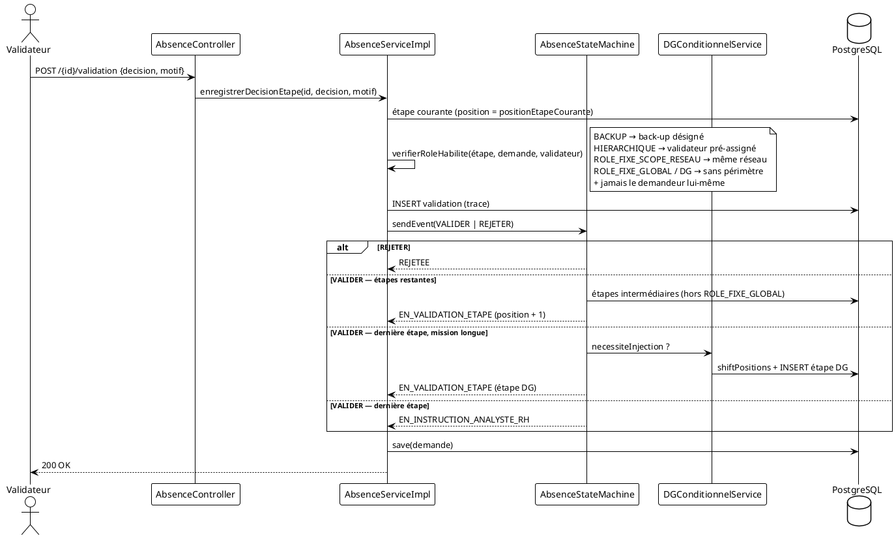
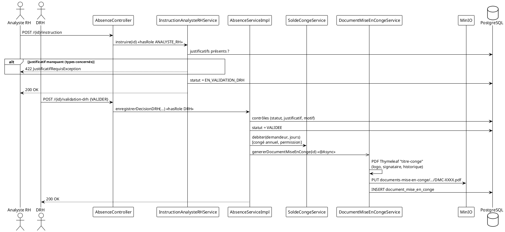
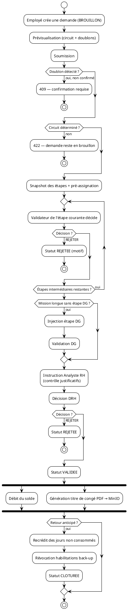
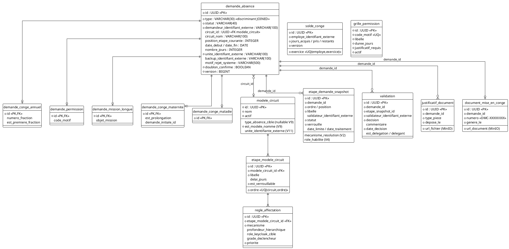

# Document d'Analyse et de Conception — Module Gestion des Absences

| | |
|---|---|
| **Projet** | INTRA-EHR — Module Absences (DC-ABSENCES v5.0) |
| **Version du document** | 1.0 |
| **Date** | 2 juillet 2026 |
| **Auteur** | Audit technique automatisé (Claude Code) — supervision Richard Mogou |
| **Périmètre** | `absences-api` (Spring Boot), `absences-front` (Next.js), infrastructure Docker (PostgreSQL, Keycloak, MinIO) |

---

## Table des matières

1. [Introduction et contexte](#1-introduction-et-contexte)
2. [Architecture générale](#2-architecture-générale)
3. [Acteurs et rôles](#3-acteurs-et-rôles)
4. [Besoins fonctionnels](#4-besoins-fonctionnels)
5. [Besoins non fonctionnels](#5-besoins-non-fonctionnels)
6. [Règles de gestion](#6-règles-de-gestion)
7. [Cas d'utilisation](#7-cas-dutilisation)
8. [Diagrammes de conception](#8-diagrammes-de-conception)
9. [Modèle de données](#9-modèle-de-données)
10. [API REST](#10-api-rest)
11. [Sécurité](#11-sécurité)
12. [Audit — constats et recommandations](#12-audit--constats-et-recommandations)

---

## 1. Introduction et contexte

Le module **Absences** gère le cycle de vie complet des demandes d'absence des employés d'une banque (AFB) : création, soumission, validation multi-étapes selon des **circuits configurables**, instruction RH, validation DRH, génération du titre de congé PDF, gestion des soldes et retour anticipé.

Principe architectural fondateur : **aucune entité Employé locale**. Les identités, grades, réseaux et liens hiérarchiques sont portés exclusivement par **Keycloak** (claims JWT + API Admin). La base ne stocke que des identifiants externes (`VARCHAR`), jamais de clés étrangères vers un référentiel employé.

### 1.1 Types d'absence gérés

| Type | Particularités |
|---|---|
| `CONGE_ANNUEL` | Fractionnement possible ; 1ʳᵉ fraction ≥ 12 jours ouvrés ; débit du solde |
| `CONGE_MALADIE` | Justificatif obligatoire ; durée en jours ouvrés |
| `PERMISSION` | Durée imposée par un barème de 13 motifs ; justificatif selon motif ; débit du solde |
| `MISSION_LONGUE` | Durée ≥ 15 jours ; étape **DG conditionnelle** injectée dynamiquement |
| `CONGE_MATERNITE` | 14 semaines (98 jours) ; prolongation de 6 semaines (42 jours) possible |

---

## 2. Architecture générale

### 2.1 Stack technique

| Couche | Technologie |
|---|---|
| Front-end | Next.js (App Router, SSR), TailwindCSS, NextAuth (Keycloak provider) |
| Back-end | Spring Boot 3, Spring Security (OAuth2 Resource Server), Spring Data JPA |
| Base de données | PostgreSQL 16 — migrations Flyway (V1 → V11) |
| IAM | Keycloak 24 (realm `absences`) — JWT + API Admin REST |
| Stockage objet | MinIO (S3) — justificatifs et titres de congé PDF |
| PDF | Thymeleaf (`titre-conge.html`) + moteur PDF |
| Orchestration | Docker Compose (5 services) |

### 2.2 Diagramme de composants / déploiement



### 2.3 Organisation du code back-end

```
com.banque.absences
├── controller     AbsenceController, CircuitAdminController, ReferentielController
├── service        AbsenceServiceImpl, AbsenceStateMachine, CircuitDeterminationService,
│                  CircuitAdminService, CircuitCoherenceCheckerService, DGConditionnelService,
│                  HierarchicalChainResolver, ClaimReaderService, DoublonDetectionService,
│                  BaremePermissionService, SoldeCongeService, InstructionAnalysteRHService,
│                  DocumentMiseEnCongeService, MinioStorageService, SystemeHabilitations
├── domain         DemandeAbsence (+5 sous-types JOINED), ModeleCircuit, EtapeModeleCircuit,
│                  RegleAffectation, EtapeDemandeSnapshot, Validation, SoldeConge,
│                  GrillePermission, JustificatifDocument, DocumentMiseEnConge
├── repository     Spring Data JPA (requêtes JPQL dédiées)
├── security       SecurityConfig, KeycloakJwtConverter, KeycloakClaims, JetonInvalideEntryPoint
├── job            BackupConflictDetectionJob
└── exception      GlobalExceptionHandler + exceptions métier typées
```

---

## 3. Acteurs et rôles

| Acteur | Rôle Keycloak / mécanisme | Responsabilités |
|---|---|---|
| **Employé (demandeur)** | authentifié (tout grade) | Crée, modifie, soumet, supprime ses demandes ; dépose les justificatifs ; déclare un retour anticipé |
| **Back-up** | désigné sur la demande (`backupIdentifiantExterne`) | Valide l'étape « Back-up » (continuité de service) |
| **Manager / N+x** | résolu via attribut Keycloak `manager` (mécanisme `HIERARCHIQUE`) | Valide les étapes hiérarchiques |
| **Chef de processus / Responsable réseau** | rôle Keycloak + périmètre réseau (`ROLE_FIXE_SCOPE_RESEAU`) | Valide dans son réseau uniquement |
| **Analyste RH** | `ROLE_ANALYSTE_RH` | Instruit le dossier (contrôle justificatifs), transmet à la DRH |
| **DRH** | `ROLE_DRH` | Décision finale ; ajustement de durée (motif `AUTRE_MOTIF`) |
| **DG** | `ROLE_DG` (étape `DG_CONDITIONNEL`) | Validation additionnelle des missions longues |
| **Administrateur RH** | `ROLE_ADMIN_RH` | Configure les modèles de circuits, résout les doublons de validateurs |
| **Système** | job planifié | Rejette automatiquement les demandes en conflit de backup |

---

## 4. Besoins fonctionnels

### BF-01 — Gestion du cycle de vie des demandes
- BF-01.1 : créer une demande en brouillon pour chacun des 5 types d'absence, avec calculs automatiques (jours ouvrés, dates de fin réglementaires).
- BF-01.2 : prévisualiser avant soumission le circuit applicable et les alertes doublon (`GET /{id}/preview`).
- BF-01.3 : soumettre une demande — détermination du circuit, snapshot des étapes, pré-assignation des validateurs.
- BF-01.4 : modifier une demande (`BROUILLON` ou `REJETEE` uniquement).
- BF-01.5 : supprimer une demande (`BROUILLON`, `REJETEE`, `REJETEE_PAR_LE_SYSTEME`).
- BF-01.6 : confirmer explicitement un doublon détecté (`confirmDoublon=true`).

### BF-02 — Circuits de validation configurables
- BF-02.1 : modéliser un circuit = suite ordonnée d'étapes, chacune portée par une ou plusieurs règles d'affectation (mécanisme + paramètres).
- BF-02.2 : déterminer le circuit applicable par cascade **grade + type + unité** → **grade + type** → **grade** (fallback).
- BF-02.3 : figer le circuit au moment de la soumission (snapshot immuable par demande).
- BF-02.4 : 5 mécanismes de résolution du validateur : `BACKUP`, `HIERARCHIQUE`, `ROLE_FIXE_SCOPE_RESEAU`, `ROLE_FIXE_GLOBAL`, `DG_CONDITIONNEL`.
- BF-02.5 : injecter dynamiquement une étape DG pour les missions longues après la dernière étape intermédiaire.

### BF-03 — Validation multi-étapes
- BF-03.1 : file « demandes à valider » personnalisée par validateur (pré-assignation ou rôle global).
- BF-03.2 : enregistrer une décision d'étape (VALIDER / REJETER) avec habilitation vérifiée selon le mécanisme.
- BF-03.3 : motif obligatoire pour tout rejet.
- BF-03.4 : progression du circuit affichée au demandeur (étapes approuvées / en cours / en attente).
- BF-03.5 : instruction Analyste RH (contrôle justificatifs) puis validation finale DRH.
- BF-03.6 : ajustement de la durée par la DRH pour les permissions `AUTRE_MOTIF`.

### BF-04 — Back-up et continuité de service
- BF-04.1 : proposer les candidats back-up (collègues de même grade et même unité + manager direct).
- BF-04.2 : le back-up désigné valide la première étape.
- BF-04.3 : détection automatique des conflits de backup (backup lui-même absent, ou désignations croisées) → rejet système avec motif.
- BF-04.4 : vue « demandes où je suis back-up ».

### BF-05 — Justificatifs et documents
- BF-05.1 : dépôt de justificatifs (multipart) stockés dans MinIO, typés par pièce.
- BF-05.2 : blocage de l'instruction RH et de la validation DRH si justificatif manquant (maladie, permission, mission longue, maternité).
- BF-05.3 : génération asynchrone du **titre de congé PDF** (template Thymeleaf, logo, signataire DRH, n° unique `DMC-XXXXXXXX`) après validation DRH, archivé dans MinIO.

### BF-06 — Soldes de congés
- BF-06.1 : consultation du solde annuel (acquis / pris / restants) par exercice.
- BF-06.2 : débit automatique du solde à la validation DRH (congé annuel, permission).
- BF-06.3 : recrédit des jours non consommés lors d'un retour anticipé.

### BF-07 — Cas particuliers métier
- BF-07.1 : prolongation de congé maternité (6 semaines, rattachée à la demande initiale validée).
- BF-07.2 : retour anticipé → clôture de la demande, recrédit du solde, révocation des habilitations du back-up.
- BF-07.3 : barème réglementaire des permissions (13 motifs, durées imposées).

### BF-08 — Administration des circuits
- BF-08.1 : CRUD des modèles de circuits (rôle `ADMIN_RH`), avec ajout automatique des étapes verrouillées **Analyste RH** et **DRH** en fin de circuit.
- BF-08.2 : contrôle de cohérence anti-doublon : une étape `HIERARCHIQUE` ne doit pas résoudre vers un grade déjà couvert par une étape `ROLE_FIXE_*` (simulation sur un employé-type du grade déclencheur).
- BF-08.3 : résolution interactive des doublons (conserver / supprimer l'étape redondante).
- BF-08.4 : activation/désactivation (soft-delete) des circuits — les demandes en cours conservent leur snapshot.
- BF-08.5 : interdiction de composer explicitement une étape `DG_CONDITIONNEL` et de modifier une étape verrouillée.

---

## 5. Besoins non fonctionnels

| Réf. | Exigence | Implémentation constatée |
|---|---|---|
| **BNF-01 Sécurité — authentification** | Toute API authentifiée par JWT Keycloak (resource server stateless) | `SecurityConfig` : `anyRequest().authenticated()`, CSRF off, sessions STATELESS |
| **BNF-02 Sécurité — habilitations** | Contrôle par rôle (`ADMIN_RH`, `ANALYSTE_RH`, `DRH`) et par périmètre métier (ownership, mécanisme d'étape) | `@PreAuthorize`, matchers URL, `verifierOwnership`, `verifierRoleHabilite` |
| **BNF-03 Sécurité — anti-IDOR** | Un agent ne voit que ses demandes ; accès demande limité au demandeur/back-up/validateurs/rôles privilégiés | Corrigé au commit `1843a9a` (P0 IDOR) |
| **BNF-04 Découplage identités** | Aucune FK ni entité Employé locale ; identifiants Keycloak en `VARCHAR(100)` | Respecté sur toutes les tables |
| **BNF-05 Performance** | Cache des règles d'affectation (`@Cacheable reglesAffectation`, clé type+grade+réseau) et du barème (`baremePermission`) ; chargement batch anti-N+1 (`toResponseBatch`, `findByDemandeIdIn`) | En place (commit `1843a9a`) |
| **BNF-06 Intégrité / concurrence** | Verrouillage optimiste (`@Version`) sur `DemandeAbsence` et `SoldeConge` ; contrainte unique solde (employé, exercice) ; unicité (circuit, ordre) | En place |
| **BNF-07 Traçabilité** | Historique des décisions dans `validation` (validateur, décision, commentaire, horodatage, délégation) ; snapshot immuable du circuit par demande | En place — mais statut des étapes snapshot non tenu à jour (voir §12) |
| **BNF-08 Auditabilité réglementaire** | Titre de congé PDF horodaté avec historique des validations, numéro unique | En place (génération asynchrone) |
| **BNF-09 Disponibilité / résilience** | Services Docker `restart: unless-stopped` ; génération PDF asynchrone (`@Async`) non bloquante | Partiel — pas de retry sur appels Keycloak Admin |
| **BNF-10 Évolutivité** | Circuits 100 % pilotés par les données (aucun circuit codé en dur) ; migrations Flyway versionnées | En place |
| **BNF-11 Internationalisation métier** | Fuseau `Africa/Abidjan`, formats dates `dd/MM/yyyy` | En place pour les documents |
| **BNF-12 Observabilité** | `/actuator/health` public ; logs SLF4J sur le job | Partiel — des `System.out.println` de debug subsistent |

---

## 6. Règles de gestion

### 6.1 Création et types d'absence

| Réf. | Règle |
|---|---|
| **RG-01** | Toute demande naît au statut `BROUILLON`, rattachée au demandeur (claim `sub`) et à son unité (claim `reseau`, à défaut l'identifiant du demandeur). |
| **RG-02** | **Mission longue** : durée intrinsèque ≥ 15 jours, sinon rejet immédiat (`DureeInsuffisanteMissionLongueException`). Date de fin calculée si absente (`début + nombreJours − 1`). |
| **RG-03** | **Permission** : la durée est imposée par la grille (13 motifs). Le motif `AUTRE_MOTIF`/`AUTRES` conserve la durée saisie ; motif inconnu → erreur (`MotifInconnuException`). |
| **RG-04** | **Congé maternité** : fin = début + 14 semaines, 98 jours calendaires, non prolongation par défaut. |
| **RG-05** | **Congé maladie / annuel** : nombre de jours = **jours ouvrés** (lundi–vendredi) entre début et fin incluses. |
| **RG-06** | **Congé annuel fractionné** : la première fraction doit compter ≥ 12 jours ouvrés. |
| **RG-07** | **Prolongation maternité** : uniquement sur une demande initiale `CONGE_MATERNITE` au statut `VALIDEE` ; début = fin initiale + 1 jour ; durée fixe 6 semaines (42 jours) ; même circuit que la demande initiale. |

### 6.2 Soumission et doublons

| Réf. | Règle |
|---|---|
| **RG-08** | Un doublon est détecté si une autre demande du même demandeur (hors `ANNULEE`/`REJETEE`) chevauche la période demandée avec une marge de ±1 jour. La soumission est bloquée sauf confirmation explicite (`confirmDoublon=true`). |
| **RG-09** | À la soumission, le circuit applicable est déterminé par cascade : ① règle *grade + type + unité*, ② règle *grade + type* (globale), ③ règle *grade seul* (globale). Aucune correspondance → `CircuitNonDetermineException` (la demande reste en brouillon). Seuls les circuits `actif = true` sont candidats. |
| **RG-10** | Le circuit est **figé** dans `etape_demande_snapshot` : les modifications ultérieures du modèle n'affectent pas les demandes en cours. |
| **RG-11** | Les validateurs `BACKUP` (back-up désigné) et `HIERARCHIQUE` (N+profondeur résolu via l'attribut Keycloak `manager`) sont **pré-assignés à la soumission**. |
| **RG-12** | Après soumission la demande passe `BROUILLON → SOUMISE → EN_VALIDATION_ETAPE`, position d'étape courante = 0. |

### 6.3 Validation des étapes

| Réf. | Règle |
|---|---|
| **RG-13** | Un demandeur ne peut **jamais** valider sa propre demande. |
| **RG-14** | Habilitation par mécanisme : `BACKUP` → être le back-up désigné ; `HIERARCHIQUE` → être le validateur pré-assigné (fallback : vérification du lien N+profondeur) ; `ROLE_FIXE_SCOPE_RESEAU` → appartenir au même réseau que le demandeur ; `ROLE_FIXE_GLOBAL` / `DG_CONDITIONNEL` → aucun périmètre. |
| **RG-15** | Tout rejet exige un motif non vide (`MotifRequisException`). |
| **RG-16** | Un rejet à n'importe quelle étape termine le circuit (`REJETEE`). Une demande rejetée est modifiable puis re-soumissible. |
| **RG-17** | Après la dernière étape intermédiaire : si type `MISSION_LONGUE` et étape DG non encore injectée → **injection d'une étape `DG_CONDITIONNEL`** (décalage des positions suivantes) ; sinon passage à `EN_INSTRUCTION_ANALYSTE_RH`. |
| **RG-18** | Les étapes intermédiaires excluent les étapes `ROLE_FIXE_GLOBAL` (Analyste RH, DRH), traitées par des statuts dédiés. |

### 6.4 Instruction RH et décision DRH

| Réf. | Règle |
|---|---|
| **RG-19** | L'instruction (rôle `ANALYSTE_RH`) exige le statut `EN_INSTRUCTION_ANALYSTE_RH` et la présence d'au moins un justificatif pour les types maladie, permission, mission longue, maternité. Elle transmet à `EN_VALIDATION_DRH`. |
| **RG-20** | La décision DRH (rôle `DRH`) exige le statut `EN_VALIDATION_DRH` ; validation bloquée si justificatif requis manquant ; rejet motivé obligatoire. |
| **RG-21** | La DRH peut ajuster le nombre de jours **uniquement** pour une permission `AUTRE_MOTIF`. |
| **RG-22** | À la validation DRH : débit du solde (congé annuel, permission) et génération asynchrone du titre de congé PDF. |

### 6.5 Soldes, retour anticipé, conflits

| Réf. | Règle |
|---|---|
| **RG-23** | Le solde est tenu par employé et par exercice civil (acquis / pris / restants), avec verrouillage optimiste. |
| **RG-24** | **Retour anticipé** : recrédit des jours entre la date de retour effective et la fin prévue (congé annuel, permission) ; révocation des habilitations du back-up ; demande `CLOTUREE`. |
| **RG-25** | **Conflit de backup** (job planifié) : si le back-up désigné est lui-même absent sur une période chevauchante — ou si deux demandes se désignent mutuellement back-up — la demande est rejetée par le système (`REJETEE_PAR_LE_SYSTEME`) avec motif explicite. |

### 6.6 Administration des circuits

| Réf. | Règle |
|---|---|
| **RG-26** | Tout circuit créé par l'admin se termine obligatoirement par deux étapes verrouillées : **Analyste RH** puis **DRH** (`ROLE_FIXE_GLOBAL`). |
| **RG-27** | Une étape `DG_CONDITIONNEL` ne peut jamais être composée explicitement dans un modèle. |
| **RG-28** | Une étape verrouillée (`estVerrouillable`) n'est pas modifiable (`EtapeVerrouilleeException`). |
| **RG-29** | **Anti-doublon** : à la création avec grade déclencheur, le système simule la résolution hiérarchique sur un employé-type du grade ; si une étape hiérarchique résout vers un grade déjà couvert par une étape `ROLE_FIXE_*`, un conflit 409 est levé, à résoudre par l'admin (conserver ou supprimer). Absence d'employé-type → 422. |
| **RG-30** | La suppression d'un circuit est logique (`actif = false`) : les demandes en cours conservent leur circuit snapshoté. |

---

## 7. Cas d'utilisation

### 7.1 Diagramme de cas d'utilisation



### 7.2 Description détaillée des cas d'utilisation principaux

#### UC-03 — Soumettre une demande

| | |
|---|---|
| **Acteur** | Employé (demandeur) |
| **Préconditions** | Demande au statut `BROUILLON` appartenant à l'appelant ; claims `grade` (et `reseau`) présents dans le JWT |
| **Scénario nominal** | 1. L'employé soumet (`POST /{id}/soumettre`). 2. Le système vérifie l'ownership. 3. Détection de doublon (RG-08). 4. Détermination du circuit (RG-09). 5. Snapshot des étapes + pré-assignation des validateurs (RG-10, RG-11). 6. Transition `BROUILLON → SOUMISE → EN_VALIDATION_ETAPE`, position 0. |
| **Alternatives** | 3a. Doublon détecté et non confirmé → 409 `DoublonDetecteException`. 4a. Aucun circuit applicable → 422 `CircuitNonDetermineException`. |
| **Postconditions** | Demande visible dans la file du premier validateur. |

#### UC-07 — Valider / rejeter une étape

| | |
|---|---|
| **Acteurs** | Back-up, Manager, Chef de processus, DG |
| **Préconditions** | Demande `EN_VALIDATION_ETAPE` ; l'appelant est habilité pour l'étape courante (RG-14) |
| **Scénario nominal** | 1. Le validateur décide (`POST /{id}/validation`). 2. Vérification d'habilitation par mécanisme. 3. Enregistrement dans `validation`. 4. Machine à états : position + 1, ou injection DG (mission longue), ou passage `EN_INSTRUCTION_ANALYSTE_RH`. |
| **Alternatives** | 2a. Non habilité → 403 `ValidateurNonAutoriseException`. 1a. Rejet sans motif → 400 `MotifRequisException`. 4a. Rejet → statut `REJETEE`, fin du circuit. |

#### UC-10 — Décision DRH

| | |
|---|---|
| **Acteur** | DRH (`ROLE_DRH`) |
| **Préconditions** | Statut `EN_VALIDATION_DRH` |
| **Scénario nominal** | 1. La DRH valide (`POST /{id}/validation-drh`). 2. Contrôle justificatif (types concernés). 3. Ajustement éventuel de durée (permission `AUTRE_MOTIF`). 4. Statut `VALIDEE`. 5. Débit du solde (congé annuel/permission). 6. Génération asynchrone du titre de congé PDF → MinIO. |
| **Alternatives** | 2a. Justificatif manquant → 422. 1a. Rejet motivé → `REJETEE`. |

#### UC-13 — Gérer les modèles de circuits

| | |
|---|---|
| **Acteur** | Admin RH (`ROLE_ADMIN_RH`) |
| **Scénario nominal** | 1. L'admin compose les étapes intermédiaires (mécanisme, rôle, profondeur). 2. Le système ajoute Analyste RH + DRH verrouillées (RG-26). 3. Contrôle anti-doublon si grade déclencheur (RG-29). 4. Circuit marqué « modèle nommé » et actif. |
| **Alternatives** | 3a. Doublon → 409 avec identifiants des étapes en conflit ; l'admin choisit `CONSERVER` ou `SUPPRIMER` (UC-14). 1a. Étape `DG_CONDITIONNEL` explicite → 400 (RG-27). |

#### UC-15 — Rejet automatique des conflits de backup

| | |
|---|---|
| **Acteur** | Système (`BackupConflictDetectionJob`, planifié) |
| **Scénario** | Pour chaque demande en cours avec back-up désigné : si le back-up a lui-même une absence chevauchante (ou désignation croisée), la demande est rejetée (`REJETEE_PAR_LE_SYSTEME`) avec motif détaillé stocké dans `motif_rejet_systeme`. |

---

## 8. Diagrammes de conception

### 8.1 Diagramme de classes — domaine



### 8.2 Diagramme d'états — cycle de vie d'une demande



### 8.3 Diagramme de séquence — soumission d'une demande



### 8.4 Diagramme de séquence — validation d'étape et fin de circuit



### 8.5 Diagramme de séquence — instruction RH, décision DRH et titre de congé



### 8.6 Diagramme d'activité — parcours de bout en bout



---

## 9. Modèle de données

### 9.1 Diagramme entités-relations



### 9.2 Historique des migrations Flyway

| Version | Contenu |
|---|---|
| V1 | Schéma initial : grille (13 motifs), circuits (3 modèles seed §4.2), demandes JOINED, snapshots, validations, soldes |
| V2 | Snapshot : `mecanisme_resolution`, `position` |
| V3 | `demande_absence.circuit_nom` |
| V4 | Snapshot : `role_habilite` |
| V5 | Table `justificatif_document` |
| V6 | Table `document_mise_en_conge` |
| V7 | `demande_permission.code_motif` |
| V8 | `demande_absence.backup_identifiant_externe` |
| V9 | Circuit : `type_absence_cible` nullable, `est_modele_nomme` (circuits nommés admin) |
| V10 | `demande_mission_longue.objet_mission` |
| V11 | Circuit : `unite_identifiante_externe` (circuits par unité) |

### 9.3 Circuits seed (V1, DC-ABSENCES §4.2)

| Circuit | Déclencheur | Étapes (mécanisme, délai) |
|---|---|---|
| **Circuit Agent** — Congé annuel | grade `AGENT` | Back-up (HIERARCHIQUE p1, 2j) → Manager (HIERARCHIQUE p1, 5j, 🔒) → Chef de processus (SCOPE_RESEAU, 3j) → Analyste RH (SCOPE_RESEAU, 3j) → DRH (GLOBAL, 3j) |
| **Circuit Manager** — Congé annuel | grade `MANAGER` | N+2 (HIERARCHIQUE p2, 5j, 🔒) → DRH (GLOBAL, 3j) |
| **Circuit Réseau** — Congé annuel | grades `DA`, `CHEF_PROCESSUS` | Responsable réseau (SCOPE_RESEAU, 5j) → DRH (GLOBAL, 3j) |

---

## 10. API REST

### 10.1 Demandes — `/api/v5/demandes`

| Méthode | Endpoint | Rôle requis | Description |
|---|---|---|---|
| POST | `/` | authentifié | Créer une demande (brouillon) |
| GET | `/` | authentifié (agent : filtré sur ses demandes) | Liste (option `?statut=`) |
| GET | `/{id}` | demandeur, back-up, validateur d'étape ou rôle privilégié | Détail + progression du circuit |
| GET | `/moi` | authentifié | Mes demandes |
| GET | `/moi/backup` | authentifié | Demandes où je suis back-up |
| GET | `/moi/solde` | authentifié | Mon solde de l'exercice |
| GET | `/a-valider` | authentifié | Ma file de validation (pré-assignation ou rôle global) |
| GET | `/demandeur/{id}` | soi-même ou rôle privilégié | Demandes d'un employé |
| GET | `/{id}/preview` | demandeur | Prévisualisation circuit + doublons |
| POST | `/{id}/soumettre?confirmDoublon=` | demandeur | Soumission |
| POST | `/{id}/validation` | validateur habilité (RG-14) | Décision d'étape |
| POST | `/{id}/instruction` | `ANALYSTE_RH` | Instruction → transmission DRH |
| POST | `/{id}/validation-drh` | `DRH` | Décision finale (+ `nombreJoursAjuste`) |
| POST | `/{id}/justificatif` (multipart) | demandeur | Dépôt justificatif → MinIO |
| POST | `/{id}/prolongation-maternite` | demandeur | Prolongation 6 semaines |
| POST | `/{id}/retour-anticipe` | demandeur | Clôture + recrédit |
| PUT | `/{id}` | demandeur | Modification (BROUILLON/REJETEE) |
| PATCH | `/{id}/statut` | ⚠️ authentifié (voir audit A-02) | Changement de statut direct |
| DELETE | `/{id}` | demandeur | Suppression (statuts autorisés) |

### 10.2 Administration — `/api/v5/admin/circuits` (rôle `ADMIN_RH`)

| Méthode | Endpoint | Description |
|---|---|---|
| GET | `/` | Liste des circuits + étapes + règles |
| GET | `/{id}` | Détail d'un circuit |
| POST | `/` | Création (étapes libres + Analyste RH/DRH verrouillées, contrôle anti-doublon) |
| POST | `/{id}/resolution-doublon` | Résolution `CONSERVER` / `SUPPRIMER` |
| PUT | `/{id}/etapes` | Modification d'étape (hors étapes verrouillées) |
| PATCH | `/{id}/toggle-actif` | Activation / désactivation |
| DELETE | `/{id}` | Désactivation logique |

### 10.3 Référentiel — `/api/v5/referentiel` (authentifié)

| Méthode | Endpoint | Description |
|---|---|---|
| GET | `/bareme-permission` | Grille des 13 motifs (cache) |
| GET | `/backup-possibles` | Candidats back-up (même grade + unité) + manager direct |
| GET | `/roles-keycloak` | Rôles realm disponibles (composition de circuits) |

---

## 11. Sécurité

### 11.1 Chaîne d'authentification

1. Le front (NextAuth) obtient un JWT via Keycloak (realm `absences`, Authorization Code).
2. L'API valide le JWT en resource server stateless ; `KeycloakJwtConverter` extrait les rôles de `realm_access.roles` avec préfixe `ROLE_`.
3. Les claims métier sont centralisés dans `KeycloakClaims` : `grade`, `reseau`, `manager`, `sub` (identifiant externe universel).
4. Pour les résolutions concernant **d'autres** utilisateurs (manager d'un demandeur, réseau d'un validateur), l'API interroge l'**API Admin Keycloak** (`GET /users/{id}`, recherche par attributs `q=grade:X reseau:Y`) via un `RestClient` dédié (client credentials).

### 11.2 Matrice de contrôle d'accès

| Ressource | Contrôle |
|---|---|
| `/actuator/health` | public |
| `/api/v5/admin/**` | `ROLE_ADMIN_RH` (URL + `@PreAuthorize` service) |
| `POST /{id}/instruction` | `ROLE_ANALYSTE_RH` |
| `POST /{id}/validation-drh` | `ROLE_DRH` |
| Toutes les autres | authentifié + contrôles métier (ownership, habilitation d'étape, visibilité filtrée) |

### 11.3 Auto-validation et périmètres

- Un demandeur ne peut pas valider sa propre demande (contrôle systématique).
- Les étapes `ROLE_FIXE_SCOPE_RESEAU` comparent le réseau du validateur à celui du demandeur (claim ou API Admin).
- La visibilité d'une demande est restreinte au demandeur, au back-up, aux validateurs du circuit et aux rôles privilégiés (`ANALYSTE_RH`, `DRH`, `ADMIN_RH`).

---

## 12. Audit — constats et recommandations

Classement : **P0** = bloquant/sécurité, **P1** = défaut fonctionnel important, **P2** = dette technique / robustesse.

### P0 — Critiques

| Réf. | Constat | Localisation | Recommandation |
|---|---|---|---|
| **A-01** | **Attributs Keycloak vides** : `grade`, `manager`, `reseau` absents de tous les utilisateurs (User Profile Keycloak 24 — les *unmanaged attributes* sont désactivés par défaut et effacés à l'édition d'un utilisateur). Toute **nouvelle** soumission échouera (circuit non déterminé) ou produira une demande **orpheline sans validateur**. | Realm `absences` | Realm settings → User profile → *Unmanaged attributes = Enabled* (ou déclarer les 3 attributs dans le profil), puis re-renseigner les valeurs. Documenter dans le README d'installation. |
| **A-02** | **`PATCH /{id}/statut` sans aucun contrôle** : tout utilisateur authentifié peut positionner n'importe quel statut (ex. `VALIDEE`) sur n'importe quelle demande, en contournant la machine à états, les habilitations, le débit de solde et la génération du titre. | `AbsenceController:97`, `AbsenceServiceImpl.updateStatut` | Supprimer l'endpoint ou le restreindre (`ADMIN_RH`) et le faire passer par la machine à états. |
| **A-03** | **Échec silencieux de la pré-assignation hiérarchique** : si `resoudreHierarchique` ne résout pas (attribut manquant, erreur), le snapshot est créé **sans validateur** (`ifPresent`), rendant la demande invisible dans toutes les files, sans erreur ni log. | `AbsenceServiceImpl:184-189` | Lever une exception bloquante à la soumission (ou a minima log WARN + alerte) lorsque le validateur d'une étape `HIERARCHIQUE` est irrésoluble. |

### P1 — Défauts fonctionnels importants

| Réf. | Constat | Localisation | Recommandation |
|---|---|---|---|
| **A-04** | **Étapes `ROLE_FIXE_SCOPE_RESEAU` invisibles dans la file « à valider »** : la requête ne matche que le validateur pré-assigné ou les rôles `ROLE_FIXE_GLOBAL`/`DG_CONDITIONNEL`. Une étape scope-réseau (ex. « Chef de processus » du circuit Agent seed) n'a pas de validateur pré-assigné → aucune file ne la remonte. | `AbsenceRepository.findDemandesAValider` | Ajouter la branche `ROLE_FIXE_SCOPE_RESEAU` (rôle + comparaison réseau) à la requête, ou pré-assigner ces étapes à la soumission. |
| **A-05** | **`etape_demande_snapshot.statut` jamais mis à jour** (reste `EN_ATTENTE` après décision) ; `date_traitement` jamais renseignée. La progression est recalculée à la volée mais la donnée persistée est fausse (reporting, SLA sur `date_limite` impossibles). | `AbsenceServiceImpl.enregistrerDecisionEtape` | Mettre à jour `statut` (VALIDEE/REJETEE) et `dateTraitement` de l'étape courante à chaque décision ; renseigner `dateAffectation`/`dateLimite` (delai_jours) à la soumission. |
| **A-06** | **Double passage Analyste RH dans le circuit Agent seed** : l'étape 4 « Analyste RH » (`ROLE_FIXE_SCOPE_RESEAU`) est comptée comme intermédiaire, puis le workflow repasse par `EN_INSTRUCTION_ANALYSTE_RH`. L'analyste validerait deux fois. | Seed V1 + `findIntermediairesOrdonnees` | Retirer l'étape Analyste RH intermédiaire du seed (ou l'exclure comme les `ROLE_FIXE_GLOBAL`). |
| **A-07** | **Cache `reglesAffectation` jamais invalidé** : la création, modification ou désactivation d'un circuit par l'admin n'évince pas le cache → l'ancien circuit reste appliqué jusqu'au redémarrage. | `CircuitDeterminationService` / `CircuitAdminService` | `@CacheEvict(value="reglesAffectation", allEntries=true)` sur toutes les mutations de circuits. |
| **A-08** | **Retour anticipé sans garde-fou** : aucun contrôle de statut (`VALIDEE` attendu) ni de cohérence de date ; recrédit en **jours calendaires** (`ChronoUnit.DAYS`) alors que le débit est en jours ouvrés. | `AbsenceServiceImpl.retourAnticipe` | Exiger `VALIDEE`, borner `dateRetourEffective` dans [début, fin], recréditer en jours ouvrés. |
| **A-09** | **`modifierEtape` ne traite que la première règle** d'une étape multi-règles (ex. étape « Responsable réseau » du circuit Réseau : 2 règles DA/CHEF_PROCESSUS). | `CircuitAdminService.modifierEtape` | Itérer sur toutes les règles ou interdire la modification des étapes multi-règles. |
| **A-10** | **Job de conflits backup en cadence de test** : cron `0 * * * * *` (toutes les minutes, commentaire indiquant l'intention horaire) ; rejette des demandes même en fin de circuit sans notification. | `BackupConflictDetectionJob:41` | Externaliser le cron en propriété (`@Scheduled(cron="${absences.backup-job.cron}")`), repasser à l'horaire, notifier le demandeur. |

### P2 — Dette technique et robustesse

| Réf. | Constat | Recommandation |
|---|---|---|
| **A-11** | `System.out.println("DEBUG ...")` en production dans `findById` (`AbsenceServiceImpl:377-387`). | Supprimer / remplacer par `log.debug`. |
| **A-12** | `verifierRoleHabilite` pour `ROLE_FIXE_GLOBAL`/`DG_CONDITIONNEL` : « aucune restriction » — le rôle (`ROLE_DG`, etc.) n'est pas vérifié sur `/validation` (seuls `/instruction` et `/validation-drh` sont protégés par rôle). Tout authentifié non-demandeur peut valider une étape DG. | Vérifier `roles.contains("ROLE_" + etape.getRoleHabilite())`. |
| **A-13** | `deposerJustificatif` : pas de validation du type MIME, de la taille, ni du statut de la demande. | Liste blanche (PDF/JPEG/PNG), taille max, restreindre aux statuts actifs. |
| **A-14** | Débit/recrédit du solde indifférencié par type (`TypeAbsence` ignoré dans `SoldeCongeService`) : permissions et congés annuels puisent dans le même compteur. | Confirmer la règle métier ; sinon compteurs séparés. |
| **A-15** | Secrets en clair dans `docker-compose.yml` (PostgreSQL, Keycloak admin, MinIO). | Fichier `.env` non versionné / secrets Docker. |
| **A-16** | `SystemeHabilitations.revoquerHabilitations` est un stub vide silencieux. | Tracer un TODO explicite + log WARN tant que l'intégration n'existe pas. |
| **A-17** | Pas de retry/circuit-breaker sur l'API Admin Keycloak (`HierarchicalChainResolver`) : une indisponibilité IAM casse soumissions et validations. | Resilience4j (retry + timeout) et messages d'erreur dédiés. |
| **A-18** | Endpoint legacy `POST /api/v5/demandes` via `creer(AbsenceRequest)` instancie `DemandeAbsence` abstraite sans type — chemin mort ou dangereux. | Supprimer le chemin legacy (`AbsenceRequest`/`StatutUpdateRequest`). |
| **A-19** | `DemandeAbsence` créée avec `unite = demandeurId` quand le claim `reseau` est absent : valeur sémantiquement fausse utilisée ensuite par la vérification « même unité ». | Rendre le claim obligatoire à la création ou stocker `NULL`. |
| **A-20** | Couverture de tests riche côté service/intégration (30+ classes) mais aucune sur `updateStatut`, `retourAnticipe` (statuts), ni la visibilité des étapes scope-réseau — précisément les zones défaillantes. | Ajouter les tests de non-régression en même temps que les correctifs A-02, A-04, A-08. |

### 12.1 Synthèse

Le socle est **sain et bien conçu** : circuits pilotés par les données avec snapshot immuable, machine à états centralisée, découplage Keycloak strict, traçabilité des validations, anti-IDOR et caches en place, bonne couverture de tests d'intégration. Les risques majeurs sont **opérationnels** (A-01 : attributs Keycloak effacés — cause racine des blocages constatés en recette) et **de contrôle d'accès** (A-02 : `PATCH /statut` ouvert). Le trio A-03/A-04/A-05 explique les demandes « qui ne suivent pas le circuit de bout en bout » : validateur non résolu → étape invisible → progression apparemment figée.

**Ordre de correction recommandé** : A-01 → A-02 → A-03 → A-04 → A-05, puis les P1 restants au fil des sprints.
